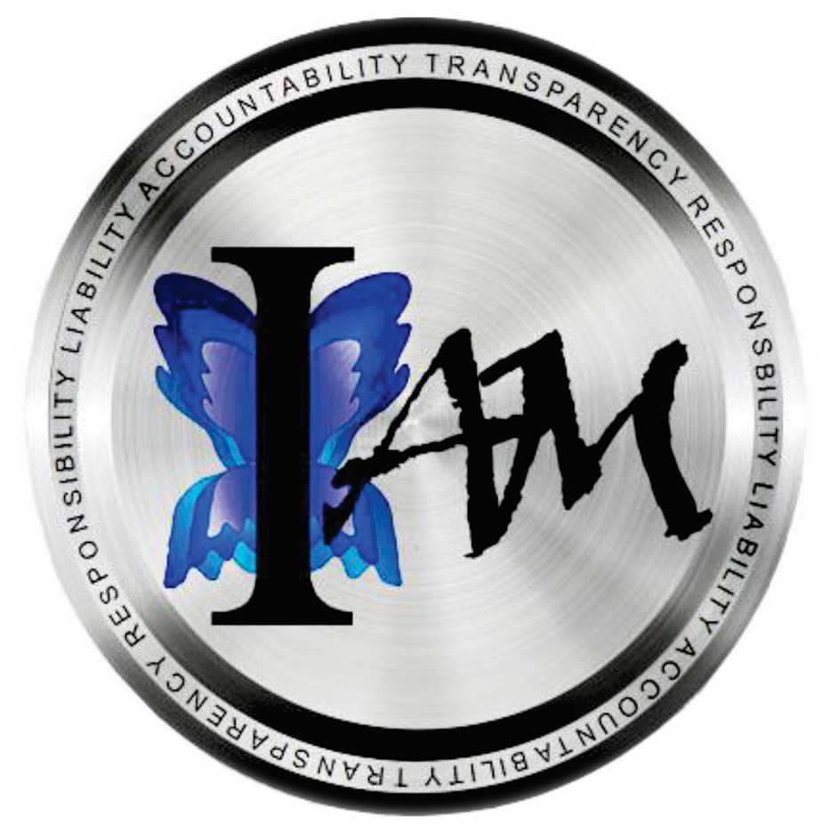

#  

# what is OPPT-ONE?
in 2012, thanks to the work carried out by the [OPPT](https://i-uv.com/oppt-absolute/) (One People Public Trust), all the governments of the world were seized. From that moment **Iure** ceased to exist.
<!-- , and they exist **de Facto** and only thanks to our consent. -->

This tool empowers living human beings around the world with web3 decentraliced, resilient amd distributed tools to save, validate and publicly display each one's documents that vindicates self-determined people as free living human beings.

 <!-- paradigm shifting experience of each one. -->

<!-- Freedom from the old enslavement system and a choice to live their lives according to their own free will and free will choices -->
 

# How it works
0. Organice and prepare your documents
1. Upload your documents (original and courtesy transalations) to IPFS
2. Mint them 
3. Get the QR code of the your NFT
4. Include them in your universal pass or show them to whoever you wish and you see fit.

# WHAT IS OPPT ONE PEOPLE´S PUBLIC TRUST
It is a legal action based on International Commercial Law which has generated documents to be applied legally in any of the countries registered as private corporations. 
 
# Links
- [https://n-prdgm.com/]
- [https://homovivo.net/]
